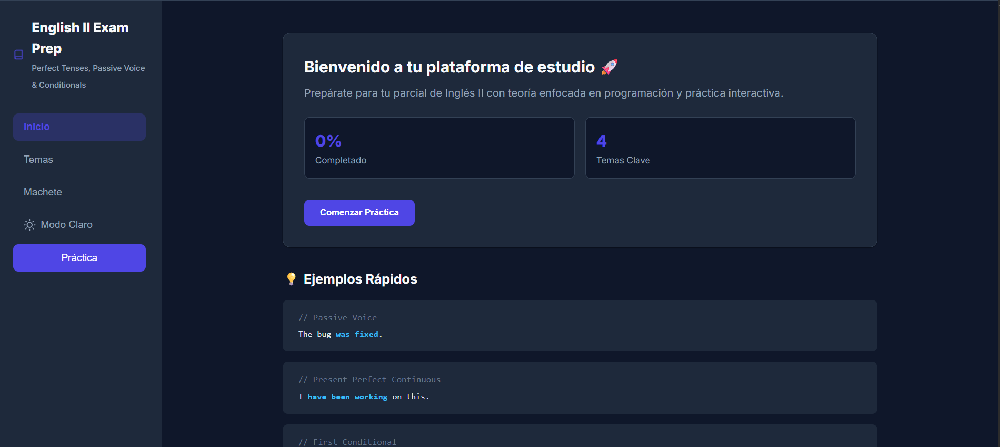

# English for Developers - Practice & Theory 🚀




Una aplicación web interactiva diseñada para estudiantes de programación y desarrolladores que buscan mejorar y practicar su inglés técnico. Este proyecto está basado en un modelo de parcial real y cuenta con explicaciones teóricas y ejercicios prácticos de autoevaluación.

## 🌟 Características Principales

*   **📚 Módulos Teóricos**: Explicaciones claras sobre temas fundamentales de gramática en inglés:
    *   Voz Pasiva (Passive Voice).
    *   Tiempos Perfectos (Perfect Tenses).
    *   Condicionales (Conditionals).
    *   Comprensión Lectora (Reading Comprehension).
*   **✍️ Práctica Interactiva**: Ejercicios basados en situaciones reales de desarrollo de software (bugs, servidores, testing, bases de datos).
*   **🎨 Diseño Premium**: Interfaz moderna, con *Dark Mode* por defecto, animaciones fluidas y un diseño *Glassmorphism* que garantiza una excelente experiencia de usuario (apto "para todo público").
*   **🛠️ Semántica Web**: Código estructurado siguiendo las mejores prácticas de HTML5 semántico, CSS moderno y JavaScript modular.

## 📂 Estructura del Proyecto

El proyecto está organizado de manera semántica y modular:

```text
📁 Parcial ingles/
├── 📄 index.html        # Estructura principal y semántica de la aplicación web
├── 📄 README.md         # Documentación del proyecto (este archivo)
├── 📁 css/
│   └── 📄 styles.css    # Estilos modernos, animaciones, variables CSS y diseño responsivo
└── 📁 js/
    ├── 📄 data.js       # Base de datos local (JSON-like) con la teoría y ejercicios
    └── 📄 app.js        # Lógica interactiva de la aplicación y renderizado dinámico
```

## 🚀 Cómo Usarlo

1.  **Clonar o Descargar** este repositorio en tu máquina local.
2.  No necesitas instalar dependencias ni usar un servidor local para la versión básica.
3.  Simplemente haz doble clic en el archivo `index.html` para abrirlo en tu navegador favorito.
4.  Navega por las pestañas de **Teoría** y **Práctica** para estudiar los temas.

## 💡 Para Todo Público

Esta aplicación está diseñada para ser intuitiva y accesible. No requieres conocimientos avanzados de programación para utilizarla como herramienta de estudio. ¡Solo abre la página y comienza a practicar tu inglés técnico!

## 📝 Autor

Creado como herramienta de estudio y práctica para desarrolladores de software.
